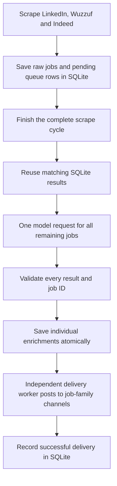

# RTJobs pipeline



The scheduler starts a scrape every six minutes. Each board persists new jobs as
it goes; source IDs deduplicate repeated scrapes. Raw descriptions are never
replaced with AI output. Historical raw jobs are not automatically classified.

Completing a scrape cycle commits its status to SQLite, then immediately
notifies the classifier. Every uncached new job from that cycle goes into **one completion request**, with no
25-job cutoff. An empty cycle makes no request; an entirely cached cycle makes
no request. Matching results use the SQLite cache, which includes relevant input,
model and prompt/schema version. Provider prompt caching is a separate automatic
optimization, visible in request usage when the provider reports it.

Full relevant input is sent by default (`CLASSIFIER_MAX_INPUT_CHARS=0`). Output
allowance scales with job count and is capped by advertised provider output
limits. OpenRouter reported a 1,050,000-token context and 128,000 maximum completion
tokens for the configured model on 2026-10-04. Context and output are separate
constraints. If a response hits a limit, omits a job or contains invalid results,
the whole outstanding batch stays pending; the worker never silently splits it
or publishes part of that response. Validated cache hits can be saved separately.

Classification results are saved per job. Shared token usage and cost belong to
one `enrichment_requests` row; each new enrichment references its request ID.
Budget is reserved before calling and reconciled with reported cost, including
paid invalid responses. Uncertain billing after a timeout retains its reservation.
The reservation covers advertised long-context pricing tiers conservatively.

Saving validated results immediately notifies the delivery worker. It posts by job family,
spaces sends to the same channel about one second apart, and acknowledges each
success in SQLite. It can post batch A while the model processes batch B. It
never posts a pending classification. Telegram failure retries delivery without
repeating classification. A rare crash/timeout after Telegram accepts a message
but before SQLite records success can cause a duplicate; Telegram sendMessage
has no transaction shared with SQLite.

## Immediate handoff

Workers receive local Unix socket notifications through the shared data volume;
no additional service or network port is needed. Producers send a nonblocking
hint only after the database transaction commits. Notifications contain no job
content. The receiving worker checks SQLite, preserving batch boundaries,
retry deadlines, delivery acknowledgements and its existing single-worker lock.
If a worker is busy, it drains saved work before waiting again.

Workers scan immediately at startup. As a recovery fallback, the classifier
checks every 30 seconds and delivery every two seconds, so a missed notification
or a crash between commit and notification cannot strand work. These intervals
also handle scheduled retries. They do not add a normal dispatch delay.

## Failures and restart

- Network, provider and validation failures stay pending with exponential delay,
  capped at one hour. They never turn into an Other prediction. The configured
  failure count is an alert threshold, not a terminal retry limit.
- Budget exhaustion waits until the next local midnight. A batch too expensive
  for the configured daily budget remains pending and requires a budget change.
- An interrupted scrape releases its saved jobs when it unwinds, or when the next
  scraper starts after a hard crash. Each cycle remains a separate batch.
- SQLite work survives worker restarts and laptop shutdown. Timers include time
  spent offline. A provider timeout or process crash can cause a billable retry.
- Existing delivered jobs retain their acknowledgements. Only undelivered
  current-schema operational fallbacks are restored to pending on migration.

## Local monitoring

The independent `monitor` service checks every minute. Defaults: worker heartbeat
and queue age 15 minutes; source scrape freshness 30 minutes; alert on three
classification/delivery failures. Authentication failures and budget pauses alert
immediately. Source parser alerts retain their existing snapshots and diagnosis.

Successful alerts are deduplicated per failure episode in SQLite. A failed alert
send retries after five minutes. Recovery resets the episode. Missing salaries
and other optional fields do not fail these checks; a run finding no new jobs
is healthy when its source checks succeed.

Local monitoring cannot report a complete machine/internet outage while offline.
External monitoring is deferred. If configured later, `HEALTHCHECK_URL` is pinged
only by the monitor when all pipeline checks pass.

```bash
docker compose --profile enrichment up -d --build
docker compose logs -f enrichment delivery monitor
# Inspect actual checks without sending alerts:
docker compose exec monitor python -m core.pipeline_monitor --once --dry-run
# Full offline suite, including whole-batch and independent-delivery checks:
.venv/bin/python scripts/verify_offline.py
```

Deploy between scrape cycles: pause the scheduler, let any active scrape finish,
stop the old classifier, back up SQLite, recreate the scraper and all three
browser-free services, then resume scheduling. Both production enable flags must
remain true for classification and channel delivery; public defaults remain off.

## First measured production cycle (before immediate notifications)

At 23:06 Cairo on 2026-10-04, 8 new jobs were classified in one request and all
8 delivered correctly. Scraping took 93 seconds, classifier pickup 28 seconds,
classification 26 seconds and delivery at most 4 seconds. That was 151 seconds
from scrape start to the final Telegram acknowledgement, plus any wait for the
six-minute schedule. Network, board login and model load can change these times.
